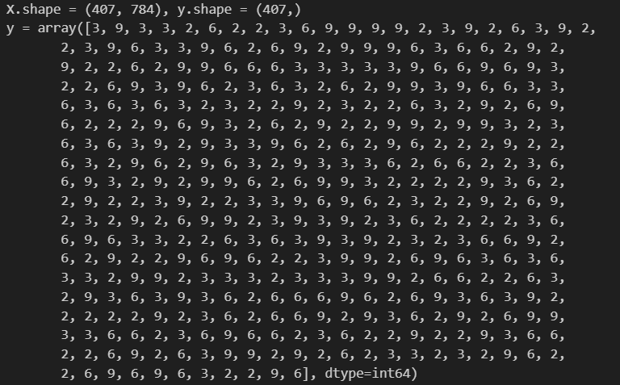
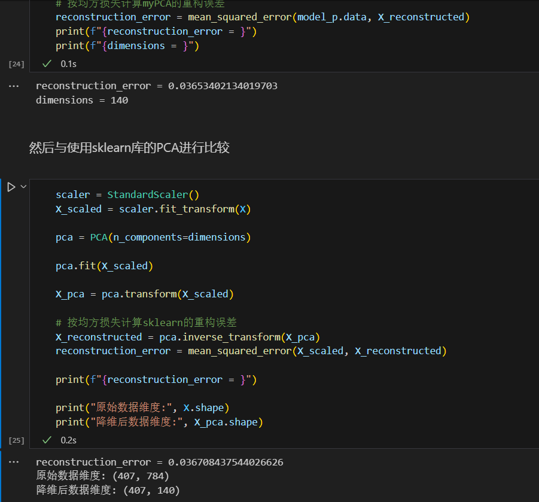
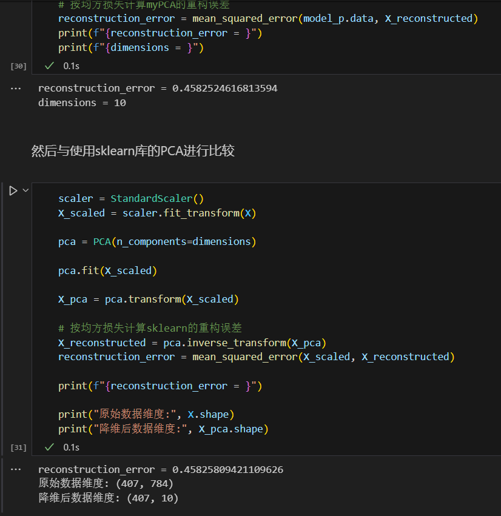
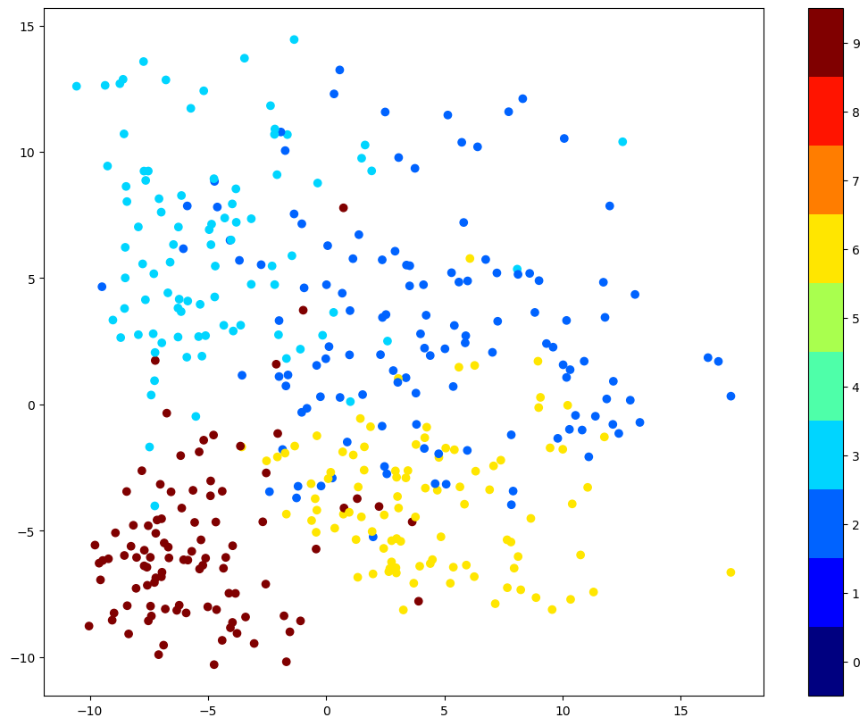
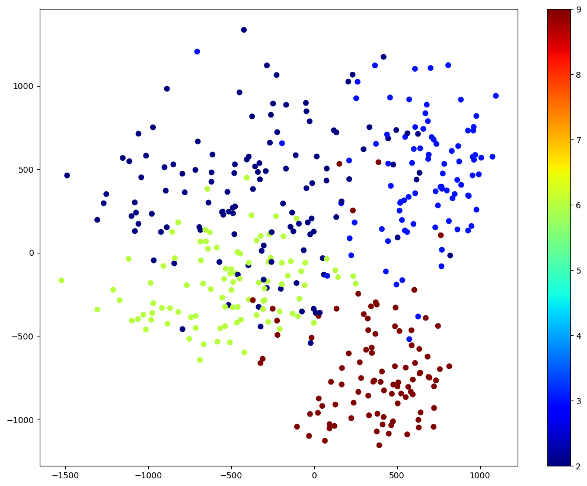
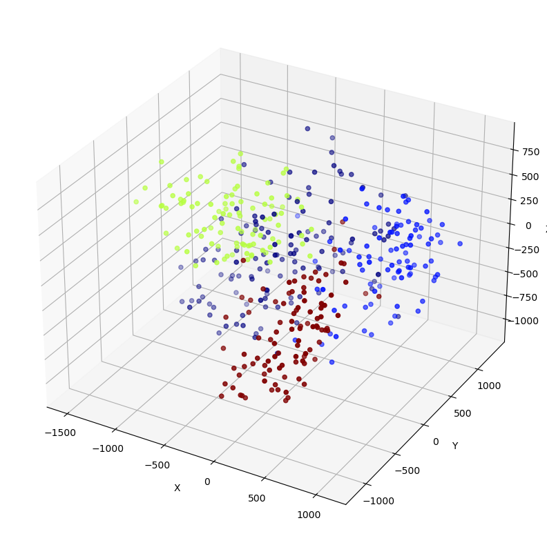

# lab4:PCA和manifold learning
## 实验目的
通过实际编程来实现PCA和流形学习算法，并对算法进行评估。探索这些算法在实际数据集上的应用，理解降维的重要性以及如何利用降维技术来揭示数据的内在结构。
## 实验原理
### 1.PCA
```
Input: Data matrix X, number of components k
    1.normalize X, let X = (X - mean(X)) / std(X)
    2.Calculate cov=X^T*X
    3.Calculate eigenvalues and eigenvectors of cov
    4.Select the top k eigenvectors and form a matrix W
Output: Projection matrix W
```
### 2.MDS
```
Input: Data matrix X, number of components k
    1.Calculate distance matrix D
    2.Calculate matrix B = -0.5 * (D^2 - 1/n * D^2 * 1 - 1/n * 1 * D^2 + 1/n^2 * 1 * D^2 * 1)
    3.Perform eigenvalue decomposition of matrix B
    4.Select the top k eigenvectors and form a matrix Lambda and matrix V
    5.Calculate matrix Y = Lambda^(1/2)
Output: V*Y
```
## 实验过程
### 1.数据预处理
使用``pandas``从``data``中读取数据,分开特征和标签,观察到数据的基本信息如下:  

可以看到标签大约有$2,3,6,9$四类.
### 2.PCA
实现PCA算法,代码如下:
```python
class myPCA:
    def __init__(self, data):
        """
        init a PCA class

        Args:
            - data: the data to be processed
        """
        self.data = data.astype(np.float64)
        # 标准化
        means = np.mean(self.data, axis=0)
        self.data -= means
        std_dev = np.std(self.data, axis=0)
        std_dev[std_dev == 0] = 1
        self.data /= std_dev
        # 计算协方差矩阵
        self.cov = np.cov(self.data, rowvar=False) # rowvar=False表示每一列代表一个特征
        # 计算特征值和特征向量
        self.eig_vals, self.eig_vecs = np.linalg.eig(self.cov) # eig_vecs的每一列是一个特征向量
        # 对特征值进行排序
        self.eig_vals_sorted_idx = np.argsort(self.eig_vals)[::-1] # 从大到小排序


    def get_d(self, t=0.95):
        """
        get the number of dimensions to be retained

        Args:
            - t: float, refactoring thresholds

        Returns:
            - d: int, the number of dimensions to be retained
        """
        for d in range(1, self.data.shape[1]+1):
            if np.sum(self.eig_vals[self.eig_vals_sorted_idx[:d]]) / np.sum(self.eig_vals) >= t:
                return d
            
    def get_w(self, d):
        """
        get the projection matrix

        Args:
            - d: int, the number of dimensions to be retained

        Returns:
            - w: ndarray, the projection matrix
        """
        return self.eig_vecs[:, self.eig_vals_sorted_idx[:d]]
```
我们首先用get_d函数计算出保留的维度,然后做一次测试  
  
接着,考虑到mnist数据集是手写数字,我们保留$10$个维度,再测试一次  
  
此时数据分布如下:  
  
可以看到,我们实现的算法与sklearn中的PCA算法得到结果的重构误差基本一致.并且数据大致分为4类,这与我们的预期一致. 
### 3.MDS
实现MDS算法,代码如下:
```python
class myMDS:
    def __init__(self, data):
        """
        init a MDS class

        Args:
            - data: the data to be processed
        """
        self.data = data.astype(np.float64)
        # 计算距离矩阵
        diff = self.data[:, np.newaxis, :] - self.data[np.newaxis, :, :]
        self.dist = np.sqrt(np.sum(diff**2, axis=-1))
        # 计算dist^2_i. 
        self.dist2_i = np.sum(self.dist**2, axis=1) / self.data.shape[0]
        # 计算dist^2_j.
        self.dist2_j = np.sum(self.dist**2, axis=0) / self.data.shape[0]
        # 计算dist^2.
        self.dist2 = np.sum(self.dist**2) / (self.data.shape[0]**2)
        # 计算B.
        self.B = np.zeros((self.data.shape[0], self.data.shape[0]))
        for i in range(self.data.shape[0]):
            for j in range(i+1, self.data.shape[0]):
                self.B[i, j] = -0.5 * (self.dist[i, j]**2 - self.dist2_i[i] - self.dist2_j[j] + self.dist2)
                self.B[j, i] = self.B[i, j]
        # 计算特征值和特征向量
        self.eig_vals, self.eig_vecs = np.linalg.eig(self.B)
        # 对特征值进行排序
        self.eig_vals_sorted_idx = np.argsort(self.eig_vals)[::-1]

    def project(self, d):
        """
        project the data to d dimensions

        Args:
            - d: int, the number of dimensions to be retained

        Returns:
            - X_mds: ndarray, the projected data
        """
        # 选取d个最大的特征值,按从大到小的顺序组成对角矩阵
        Lambda = np.diag(self.eig_vals[self.eig_vals_sorted_idx[:d]])
        # 选取d个最大的特征向量,按从大到小的顺序组成矩阵
        V = self.eig_vecs[:, self.eig_vals_sorted_idx[:d]]
        # 计算X_mds
        X_mds = np.sqrt(Lambda).dot(V.T)
        return X_mds.T
```
分别降至$2,3$维,结果如下:  
  
  
可以看到,数据大致分为4类,这与我们的预期一致. 
## 结果分析
在实现PCA算法时,我发现,如果只做中心化,不做标准化,得到的重构误差大约是sklearn库的500倍,这说明标准化对PCA算法的性能有很大影响. 
另外,根据对比,我发现PCA算法的效率比MDS算法略高一点. 
两种方法产生的数据都大致分为四类,这与我们初期的观察相符,这说明降维算法能帮助我们有效地观察出数据的特征,帮助分析数据的分布结构. 
## 实验总结
通过本次实验,我不仅理解了PCA和MDS算法的数学原理，还通过编程实践深化了对这些原理的应用理解,例如如何使用NumPy的矢量化操作来优化算法性能，特别是在计算复杂的距离矩阵时.总的来说，这次实验不仅加深了我对PCA和MDS等降维技术的理解，也提升了我的编程和数据分析能力
